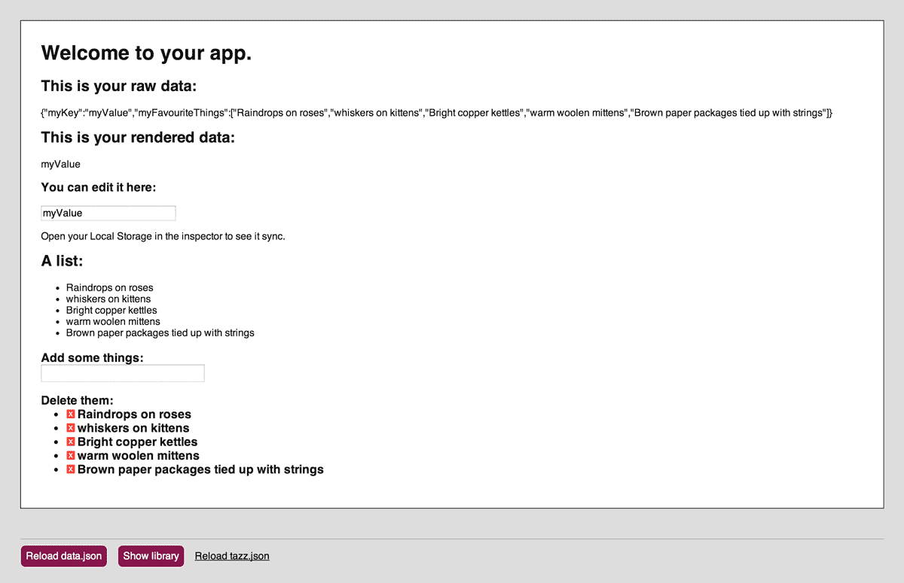

# Tazz

Deployable zero-configuration prototyping stack for designers.

## Features

Start protyping your app instantly with the L.E.A.N.™ Stack

- [Local Storage](https://en.wikipedia.org/wiki/LocalStorage#localStorage)
- Einhörner
- [AngularJS](http://angularjs.org/)
- [Node](http://nodejs.org/)

Supports by default

- [Sass](http://sass-lang.com/)
- [Jade](http://jade-lang.com/)
- [CoffeeScript](http://coffeescript.org/)
- or vanilla HTML/CSS/JS

Sugar:
- [LiveReload](http://livereload.com/)
- Growing library of UI goodies so you can focus on how-it-works

## Use

Needs [node.js](http://nodejs.org/), [Bower](http://bower.io/) and [Grunt CLI](http://gruntjs.com/getting-started#installing-the-cli). Bower *needs* [Git](http://git-scm.com/) and [Sass](http://sass-lang.com/) needs [Ruby](https://www.ruby-lang.org/en/).

    $ git clone git@github.com:filtercake/tazz.git my_new_prototype
    $ cd my_new_prototype
    $ npm install
    $ bower install
    $ grunt

You should then be able to look at the compiled page at <http://localhost:3000/>.

## Contribute

All input on how stuff could be done better/easier/simpler is welcome, just dump an issue.

There is also a [board at waffle.io](https://waffle.io/filtercake/tazz): 
