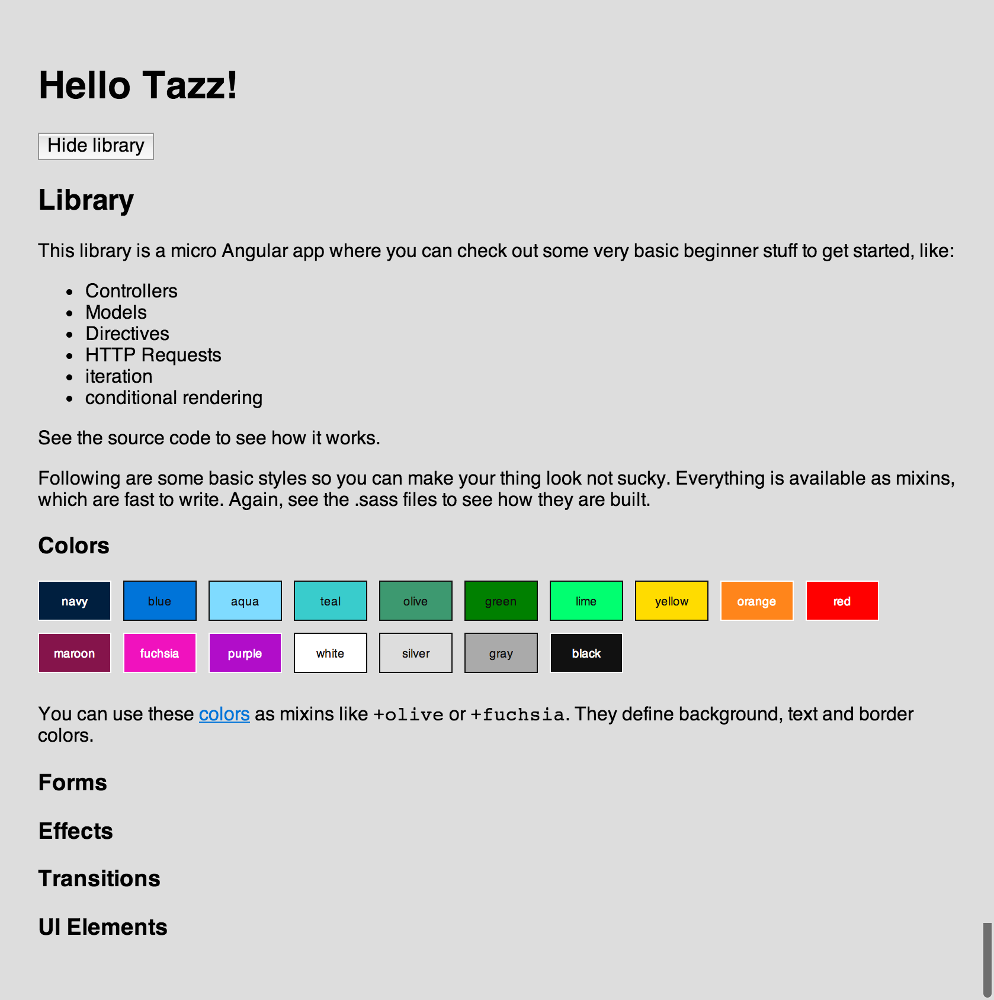

# Tazz

Goal: deployable zero-configuration prototyping stack for designers.

## Features

Start protyping your app instantly with

- [AngularJS](http://angularjs.org/)
- [Sass](http://sass-lang.com/)
- [Jade](http://jade-lang.com/)
- [CoffeeScript](http://coffeescript.org/)
- or use vanilla HTML/CSS/JS

Some sugar:
- [LiveReload](http://livereload.com/)
- [Colors](http://clrs.cc/)

## Use

Needs [node.js](http://nodejs.org/) and [Grunt CLI](http://gruntjs.com/getting-started#installing-the-cli).

    $ git clone git@github.com:filtercake/tazz.git my_new_prototype
    $ cd my_new_prototype
    $ npm install
    $ bower install
    $ grunt

You should be able to look at the compiled page at <http://localhost:3000/>.

## FAQ

- Does it have a UI Kit yet? No.
- Does it have a database yet? No.
- Is it deployable yet? No.
- Does it have a license yet? No.